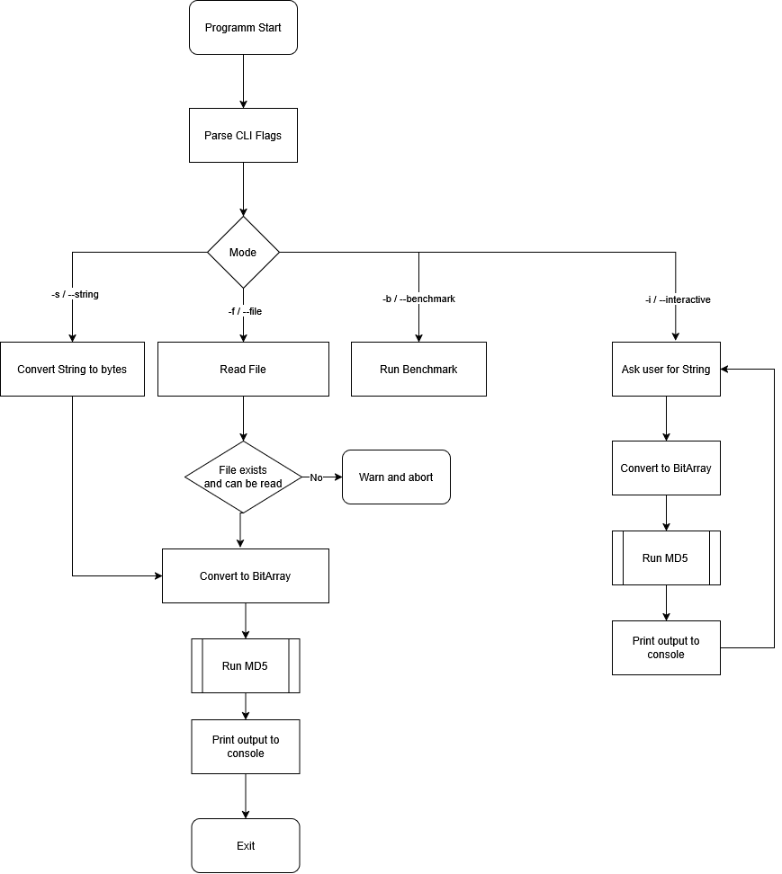

# Daniel Schmerber MD5-Hash comparison 

This is a small CLI tool, to create MD5 hashes of either Strings or Files.

# Usage: 
    -s <string> -> returns the MD5 hash of the passed string
    -f <path> -> returns the MD5 hash of a given file
    -i -> interactive mode
    -h -> prints help message
    -b -> benchmarks the tool (only in gleam)

# Structure
Both glem and go are structured simular

the main file (md5.gleam / main.go) contain all the logic to parse the commandline arguments

the algorithm file, contains the md5 hashing algorithm

bitutil contains code, that implements bitwise functionalities, required for the algorithms

# Flow
The flow of the programm can be visualized like this

# Gleam

## Requirements:
Gleam version >=1.13.0 (https://gleam.run/getting-started/installing/)
ErlangVM

## Run Project:
Download Dependencies (if missing): gleam deps download
Run : gleam run

## Test Project:
- gleam test

## Build Project
- gleam build
- gleam run -m gleescript
- Run Standalone: escript md5

## Benchmark Project

Run the cli with the --benchmark flag

# Go

## Requirements:
- Go (https://go.dev/dl/)

## Run Project:
- Run: go run .

## Test Project:
- go test ./...

## Build Project:
- go build
- Run Binary: ./<binary-name>

## Benchmark Project:
- go test -bench .